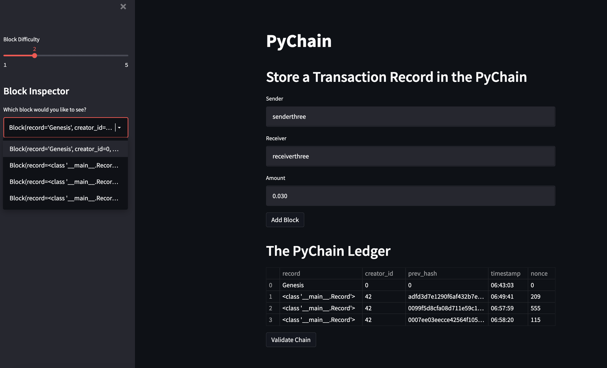

# PyChain Ledger: Challenge_18 

### Step 1: Create a Record Data Class
* Create a new data class named `Record`. This class will serve as the blueprint for the financial transaction records that the blocks of the ledger will store.

### Step 2: Modify the Existing Block Data Class to Store Record Data
* Change the existing `Block` data class by replacing the generic `data` attribute with a `record` attribute that’s of type `Record`.

### Step 3: Add Relevant User Inputs to the Streamlit Interface
* Create additional user input areas in the Streamlit application. These input areas should collect the relevant information for each financial record that you’ll store in the `PyChain` ledger.

### Step 4: Test the PyChain Ledger by Storing Records
* Test your complete `PyChain` ledger. 

Image below shows the final results.

